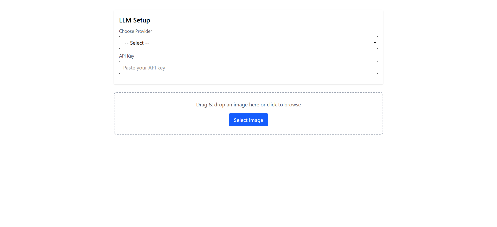
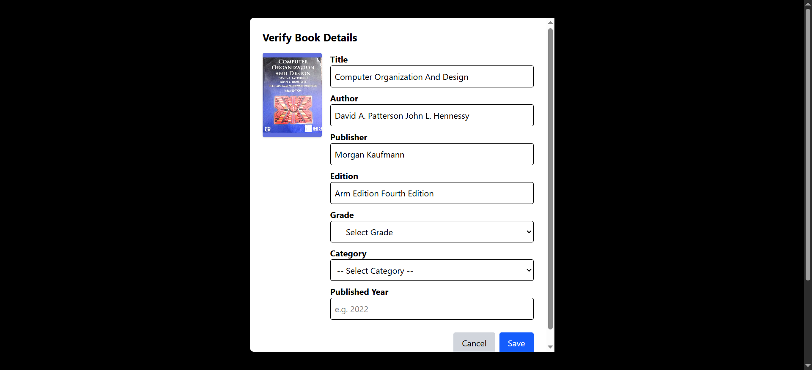
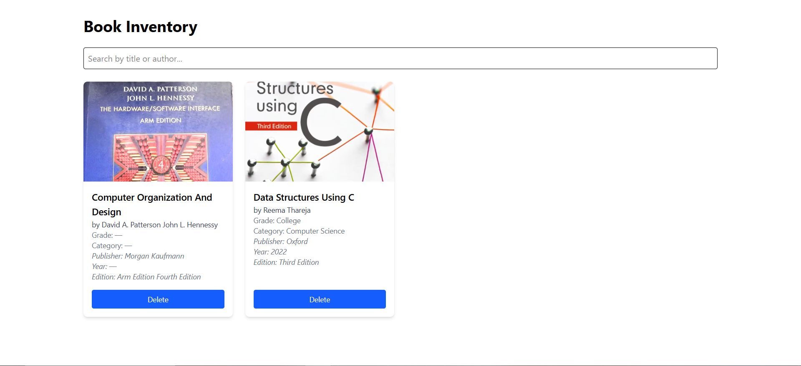

# Book Inventory Builder

A web application that helps educators and librarians digitize and manage book collections by simply uploading photos of book covers. The app uses **AI Vision models** (Google Gemini Flash) to extract book details like title, author, grade, subject, and more.

---

## Demo
**Live Demo:-** [https://book-snap-iota.vercel.app](https://book-snap-iota.vercel.app)

**Video Demo:-**[watch](https://drive.google.com/file/d/1hYIyl6ymj2U-3U_CYsrYmao_FdrTd1vY/view?usp=sharing)

## Features

- Upload book cover images (drag-and-drop or camera)
- AI extracts metadata: title, author, category, grade, publisher, etc.
- Edit and verify extracted details
- Save books to inventory
- View/search/delete books from inventory
- Support for Google Gemini Flash
- Cloudinary integration for image hosting

---

## Tech Stack

- **Frontend**: React + Tailwind CSS
- **Backend**: Node.js + Express
- **Database**: MongoDB Atlas
- **Image Upload**: Multer + Cloudinary
- **AI Vision**: Google Gemini Flash

## Steps to Get Gemini API Key:

- Go to: https://makersuite.google.com/app
- Sign in with your Google account.
- Visit: https://aistudio.google.com/app/apikey
- Click “Create API Key”


### Getting Started


1. Clone the repository:

   ```bash
   git clone https://github.com/chandra865/BookSnap.git
   cd BookSnap

   ```

2. Frontend setup:

   ```bash
   cd frontend
   npm install
   npm run dev

   ```

3. Backend setup:
   ```bash
   cd backend
   npm install
   npm start
   ```
4. Environment Variables:
- backend 
```bash
PORT
DB_NAME=
CORS_ORIGIN
MONGODB_URI
CLOUDINARY_CLOUD_NAME 
CLOUDINARY_API_KEY
CLOUDINARY_API_SECRET
```

- frontend
```bash
    VITE_BACKEND_URL
```

## Deployment
- Frontend on Vercel
- Backend on Render
---

## Screenshots

### Book Upload Page



### Book Details Extracted



### Inventory View


